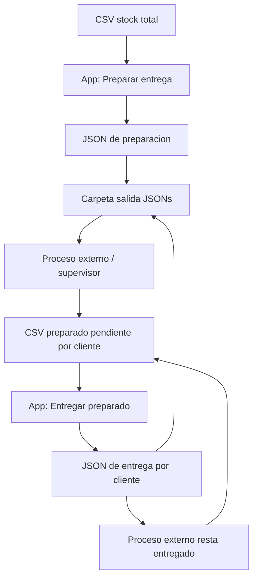

# Proyecto - Control Stock V2

## Estado actual

La aplicacion paso de ser un flujo unico de preparacion contra stock a una V2 con dos etapas:

1. Preparacion de entrega contra stock total.
2. Entrega de rollos ya preparados contra una base de preparado pendiente por cliente.

La app esta funcionando en preview web y ya se probo el flujo completo de entrega con Google Drive y Apps Script. El siguiente paso operativo es probar en celular, primero con Expo Go y despues con APK preview.

## Flujo funcional



## Carpetas y origenes Drive

Stock total:

```text
DB_FOLDER_ID = 1IVLZcxJ5rd9jdNbNolOXhB-1rDBeSuZV
```

Preparado pendiente:

```text
DELIVERY_FOLDER_ID = 1EkL15uYd-E31Y0uD9R6jLctC4DqLCzy2
```

Salida de JSONs:

```text
JSON_FOLDER_ID = 1Q8la1daByqpgnYH3WwCeIgsnYlaBhiNp
```

URL publicada del Apps Script:

```text
https://script.google.com/macros/s/AKfycbzRtzlpC_Q3y8f3kyl63YWHZvgFIMGDVUojLg8WYJHufH17fU3gDb2NaIQwUu5KeD90EQ/exec
```

## Etapa 1 - Preparacion

El operario inicia una sesion de preparacion y escanea rollos contra el stock total sincronizado. Cada dispositivo genera un payload JSON de preparacion.

El JSON de preparacion se sube a la carpeta configurada como `JSON_FOLDER_ID`.

Ese JSON no asigna clientes dentro de la app. La asignacion por cliente ocurre afuera: el supervisor o sistema externo toma las preparaciones, arma el preparado pendiente por cliente y publica un nuevo CSV en la carpeta `DELIVERY_FOLDER_ID`.

## Etapa 2 - Entrega

La app se hidrata desde el CSV de preparado pendiente. Cada fila representa un rollo preparado y asignado a un cliente.

El operario escanea lo que efectivamente se carga o sale. No hay camion ni instancia preasignada. La app busca cada rollo en el preparado pendiente, obtiene el cliente desde esa base y agrupa la entrega automaticamente.

Al finalizar, la app genera un JSON por cliente y los sube a la misma carpeta `JSON_FOLDER_ID`.

Cada carga efectiva tiene un `load_id` con fecha y hora, por ejemplo:

```text
carga_20260526_135046
```

Ese `load_id` queda en el nombre del archivo, en `header.load_id` y en cada item entregado.

## Regla anti reutilizacion

Cuando una entrega se revisa y exporta correctamente, la app marca localmente como consumido el `manifest_id + manifest_version` del CSV usado.

Esto evita reutilizar la misma planilla de preparado pendiente para otra entrega. Para volver a entregar, el proceso externo debe publicar una nueva version del preparado pendiente, cambiando `manifest_version`.

Ejemplo probado:

```text
manifest_id = PREP-2026-05-26
manifest_version = 2026-05-26-002
```

## CSV de preparado pendiente

Columnas actuales:

```csv
manifest_id,manifest_version,cliente_id,cliente_nombre,id_barra,cod_articulo,descripcion,peso_nominal,color
```

Archivo local de prueba creado:

```text
C:\Antigravity\Control_Stock\preparacionprueba_v2.csv
```

## JSONs de entrega verificados

Se verifico que los archivos nuevos salen con `load_id` en el nombre:

```text
delivery_2026-05-26_Diego_Rebora_CLI-001_carga_20260526_135046_del_1779.json
delivery_2026-05-26_Diego_Rebora_CLI-002_carga_20260526_135046_del_1779.json
```

Tambien se verifico que el contenido interno incluye:

```json
"load_id": "carga_20260526_135046",
"manifest_version": "2026-05-26-002"
```

## Cambios tecnicos implementados

Se agregaron o modificaron las piezas principales:

- `sessions`: sesiones persistentes por modo.
- `scan_events`: eventos de escaneo comunes para preparacion y entrega.
- `delivery_plan_items`: maestro local de preparado pendiente.
- `export_outbox`: historial/outbox de exportaciones.
- `sessionService`: creacion de sesiones y `device_id`.
- `deliveryPlanService`: sync del preparado pendiente.
- `scanWorkflowService`: validacion de scans segun modo.
- `exportService`: JSON de preparacion y JSON de entrega por cliente.
- `Codigo_Google_Script.js`: GET para stock y delivery, POST para subir JSONs.

## Archivos importantes

```text
App.tsx
Codigo_Google_Script.js
src/constants/api.ts
src/db/database.ts
src/services/sessionService.ts
src/services/deliveryPlanService.ts
src/services/scanWorkflowService.ts
src/services/exportService.ts
src/services/syncService.ts
src/screens/DashboardScreen.tsx
src/screens/ScannerScreen.tsx
src/screens/ReviewScreen.tsx
docs/v2_blueprint.md
progress.md
task_plan.md
```

## Verificaciones realizadas

TypeScript:

```powershell
npx tsc --noEmit
```

Build web:

```powershell
npx expo export --platform web
```

Preview web:

```text
http://127.0.0.1:8082
```

Endpoint delivery check:

```text
?dataset=delivery&action=check
```

Respuesta esperada:

```json
{"status":"success","dataset":"delivery","fileName":"preparacionprueba_v2.csv"}
```

## Proximo paso

Probar en celular.

Primera pasada rapida:

```powershell
npx expo start
```

Luego escanear el QR con Expo Go y validar camara, SQLite, preparado pendiente, escaneo, revision y export.

Segunda pasada:

```powershell
npx eas build --platform android --profile preview
```

Esto genera un APK instalable para prueba mas cercana al uso real.

---

## Registro de Avance
- 2026-07-11: Proyecto suspendido. No se llegó a un acuerdo comercial con el cliente.
- 2026-06-03: APK terminada.
- 2026-06-01: Se modificó la modalidad de entrega (posibilidad de envío one touch de la carga terminada por cliente) y se confeccionó el presupuesto y documento técnico para el cliente.
- 2026-05-31: Se generó documento técnico para presentar al cliente. Debe presentarse, responsable. Atika
- 2026-05-28: Surgió un inconveniente en el canal web. Se evalúa desarrollar una Flask-API o un ejecutable local para hidratar/recolectar datos de la app.
- 2026-05-28 20.30hs.: Ya creamos el task plan. Se hará una integración con Google Drive Desktop a cargo de Diego R.
- 2026-05-26: Flujo completo de entrega probado con Google Drive y Apps Script en entorno de preview web.
- 2026-05-26: Estructuración de base de datos local SQLite y reglas anti-reutilización verificadas con manifest_version.

## PROXIMOS PASOS
- N/A (Proyecto suspendido) 